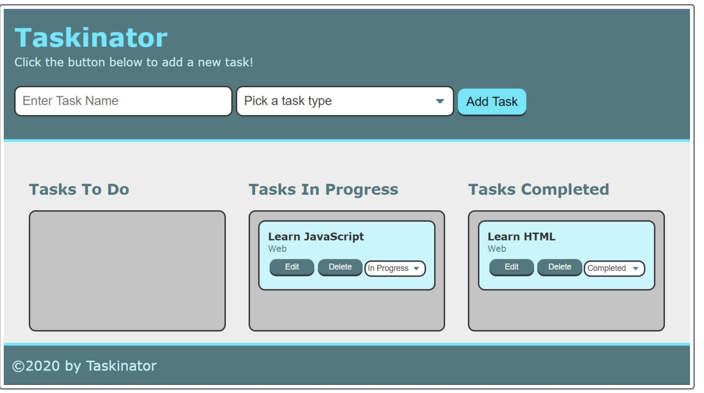

# Password Generator

### User Story
As a User I am looking for a simple web app that will generate a password for me. This app should ask me for my input on length of password and wether I want capital letters, lowercase, numbers and or special characters. After answering all of these questions I should then be given a password that matches the criteria.
### Features
This is a web application password generator
This app will ask for input from the user 
The user will be prompted on how long they want their password to be
The user will be prompted if they want lowercase or uppercase characters
The user will be prompted if they want numbers in their passsord
the user will be prompted if they want special characters in their passowrd

### badges

## Table of Contents

- [installation](#installation)
- [contribution guidelines](#contribution)
- [Test Instructions](#testing)
- [License](#license)
- [Questions](#questions)

### Installation
1. Please clone the github repo here :
https://github.com/Vinyldude8896/Password-Generator
2. The open the index.html file in your default browser.

### Contribution Guidelines
Current contributers:
Kevin Reid : https://github.com/Vinyldude8896  

### Testing
To test this app: 
1. Clone the repo here : https://github.com/Vinyldude8896/Password-Generator  
2. Load the index.html file in your default browser
4. Click generate Password
5. Answer each question
6. You should then be given a password based on your input 

### Questions
    email address : kevinnivek@me.com
    - additional instructions 
    I can be contacted by phone as well, but prefer email contact first.
### Images

### Deployed Link
Link to the page is here : https://vinyldude8896.github.io/Password-Generator/